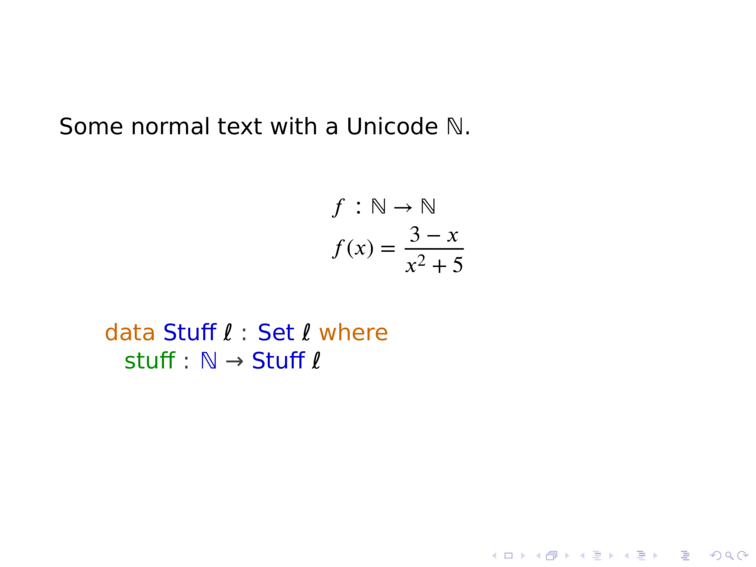

# A template for Literal Agda slides with XeLaTeX/Beamer

I always forget the exact incantation that persuades Beamer to render the
Unicode nonsense in my Agda slides, so here it is, gloriously reusable.

Tested with TeXLive 2019, 2020 and Agda 2.6.0.1, 2.6.1

Result:

